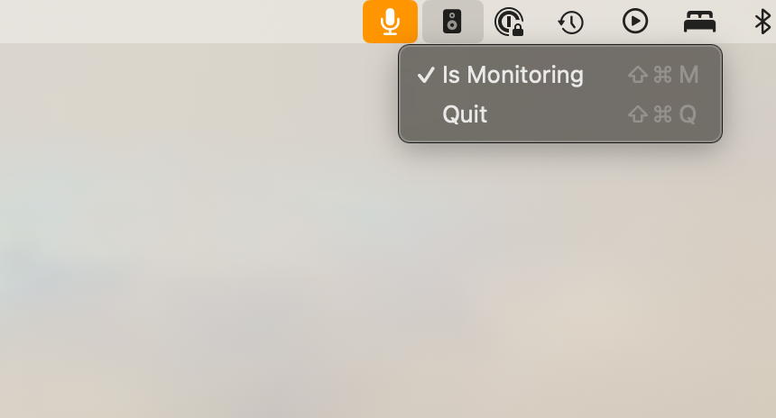

#  Monitor

## _Really_ basic audio passthrough System Status Bar app.

### Features

1. Toggle - enable/disable audio monitoring of system input to output.

2. Quit - Quit the App

### Under the Hood

* `AVAudioEngine` 

* System Inputs and Outputs Used

* NO Additional Controls - Input and Output gain from SysPrefs Panel
